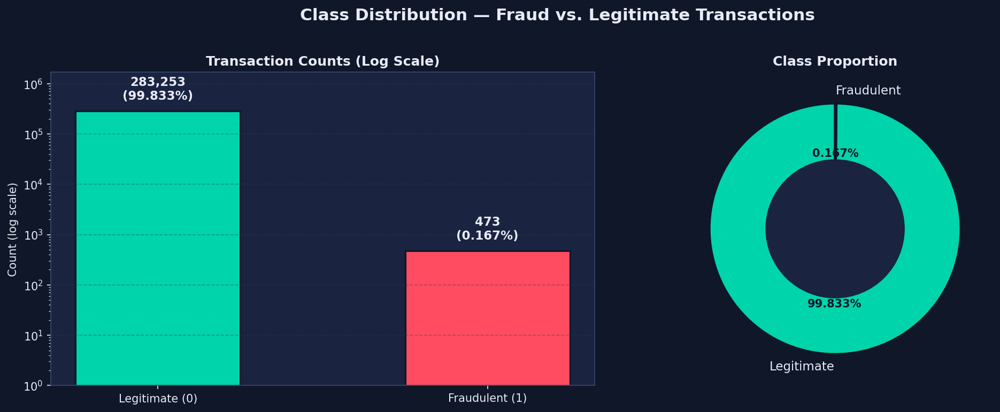
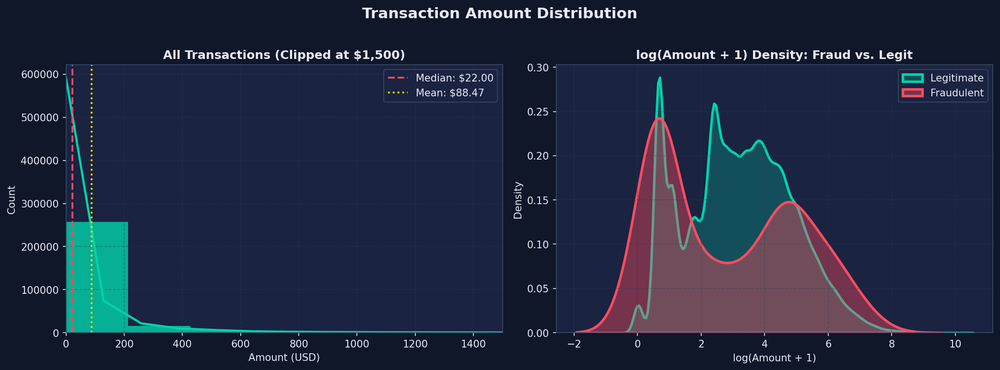
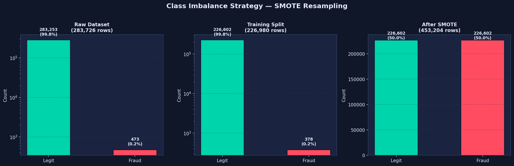
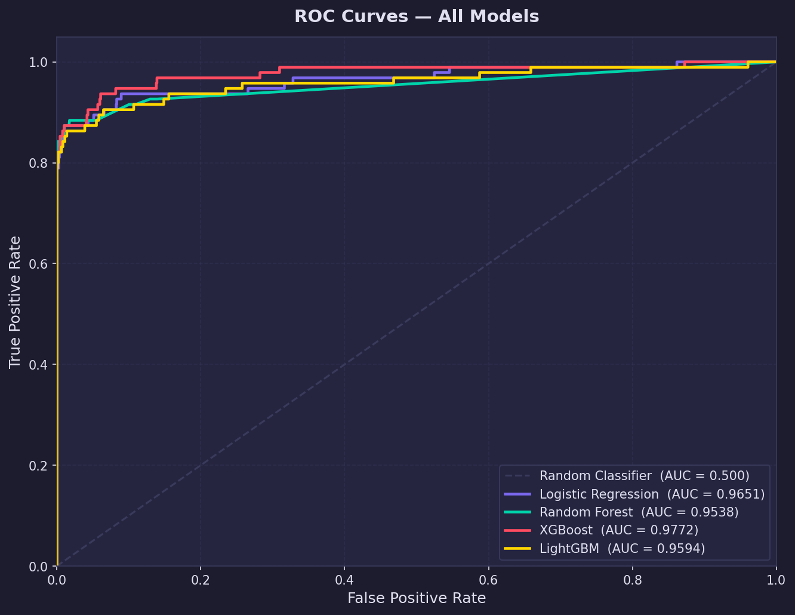
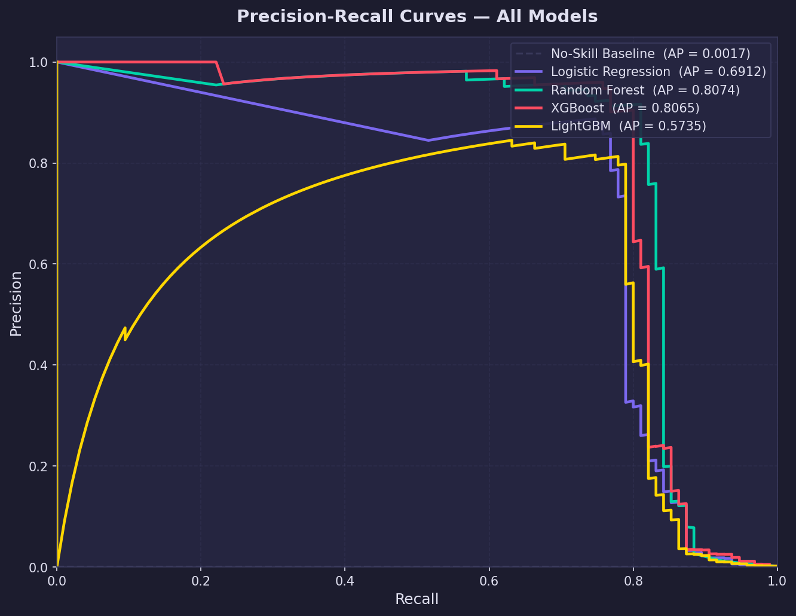
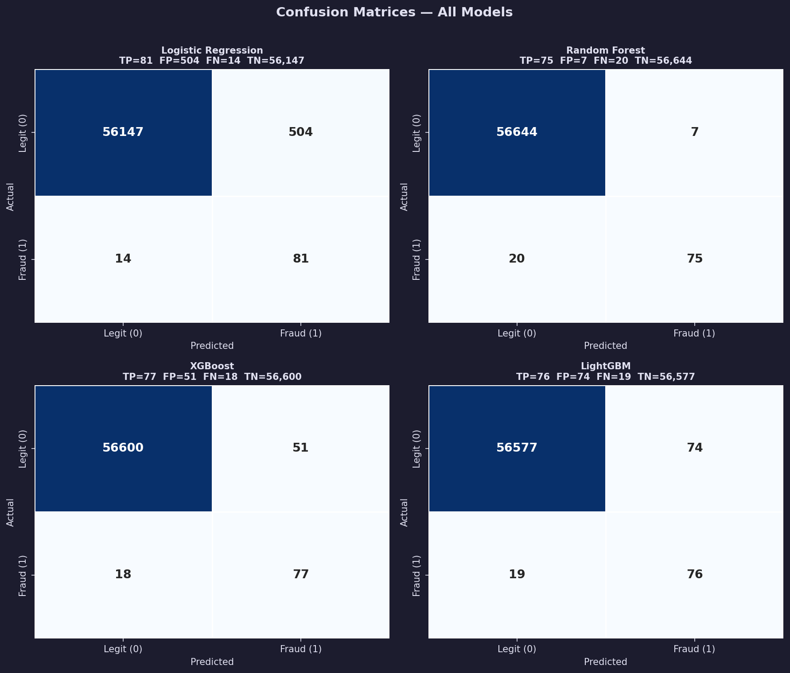
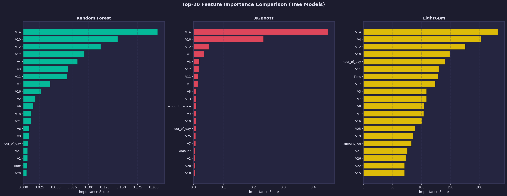

<div align="center">

# 💳 Credit Card Fraud Detection

### End-to-End ML Pipeline · EDA → Modelling → SHAP → Business Impact


</div>

---

## 🎯 Problem Statement

Credit card fraud costs the global economy **billions annually**.  
This dataset presents a classic **extreme class imbalance** — only **0.17% of 284,807 transactions are fraudulent**, making standard accuracy metrics dangerously misleading.

> **Goal:** Maximise fraud recall while keeping false-alarm rates operationally viable — then quantify real-world dollar impact.

---

## 📊 Dataset at a Glance

| Property | Value |
|---|---|
| Raw rows | 284,807 |
| After deduplication | 283,726 |
| Features | 28 PCA components (V1–V28) + Time + Amount |
| Engineered features | `hour_of_day` · `amount_log` · `amount_zscore` |
| Fraud rate | **0.17%** |
| Train / Test split | 80 / 20 stratified |
| Test set | 56,746 transactions (95 fraud) |

---

## 🗂️ Project Structure

```
FRAUD_DETECTION/
├── DAY 1/                        ← EDA + Feature Engineering + SMOTE
│   ├── DAY_1_fraud_eda_pipeline.py
│   ├── export_processed_datasets.py
│   ├── charts/                   ← 14 EDA charts
│   └── processed/                ← train_raw · test_raw · train_smote
│
├── DAY 2/                        ← Modelling + Threshold + SHAP + Business
│   ├── fraud_detection_day2.py
│   ├── fraud_threshold_shap_business.py
│   └── output/
│       ├── models/               ← .pkl (XGBoost · RF · LightGBM · LR)
│       ├── plots/                ← ROC · PR · SHAP · Business Impact
│       └── results/              ← reports + CSVs
│
└── DAY 3/                        ← Power BI export datasets
    └── output/powerbi/
```

---

## 📈 Day 1 — EDA & Feature Engineering

### Class Distribution


### Transaction Amount — Fraud vs Legitimate (Log Scale)


### Feature Correlation with Fraud Class


### SMOTE Balancing — Before & After


| Split | Rows | Fraud % |
|---|---|---|
| Train Raw | 226,980 | 0.17% |
| **Train SMOTE** | **453,204** | **50.00%** |
| Test | 56,746 | 0.17% |

> ⚠️ SMOTE applied to **training only** — test set kept at real-world 0.17% fraud rate (no leakage).

---

## 🤖 Day 2 — Model Training & Evaluation

### Model Comparison

| Rank | Model | ROC-AUC | Recall | Precision | F1 | Accuracy |
|---|---|---|---|---|---|---|
| 🥇 | **XGBoost** | **0.9772** | 0.8105 | 0.6016 | 0.6906 | 99.88% |
| 🥈 | Logistic Regression | 0.9651 | 0.8526 | 0.1385 | 0.2382 | 99.09% |
| 🥉 | LightGBM | 0.9594 | 0.8000 | 0.5067 | 0.6204 | 99.84% |
| 4 | Random Forest | 0.9538 | 0.7895 | 0.9146 | 0.8475 | 99.95% |

### ROC Curves — All 4 Models


### Precision-Recall Curves


### Confusion Matrices

---

## ⚙️ Threshold Optimisation

> Default threshold of **0.50 is suboptimal** for fraud. Cost-benefit analysis run across all thresholds.

**Cost Assumptions:**

| Type | Cost | Breakdown |
|---|---|---|
| False Positive (FP) | $50 | $15 investigation + $25 service call + $10 churn |
| False Negative (FN) | $388.59 | $155.43 avg fraud × 2.5× chargeback |

### Threshold vs. Metrics


### Threshold Cost Curve


**📌 Recommended threshold: `0.86`**

| Metric | Default 0.50 | ✅ Optimal 0.86 |
|---|---|---|
| Fraud Recall | 81.0% | 80.0% |
| False Alarm Rate | 0.090% | **0.014%** |
| Precision | 60.2% | **90.5%** |
| F1 Score | 0.691 | **0.849** |
| Test-set Cost | $9,544 | **$7,783** |

---

## 🧠 SHAP Explainability

### Global Feature Importance


### Beeswarm — Feature Impact Distribution


### Waterfall — Single Fraud Transaction Explained


### Top 5 Fraud Signal Features

| Rank | Feature | Mean \|SHAP\| | Direction |
|---|---|---|---|
| 1 | **V14** | 2.390 | ↓ Low → fraud risk ↑ |
| 2 | **V4** | 1.573 | ↑ High → fraud risk ↑ |
| 3 | **V12** | 0.915 | ↓ Low → fraud risk ↑ |
| 4 | **V10** | 0.575 | ↓ Low → fraud risk ↑ |
| 5 | **V11** | 0.534 | ↑ High → fraud risk ↑ |

### Feature Importance — All Models Side by Side



---

---

## 🔤 Technical Glossary

<details>
<summary><b>📖 Click to expand — Key Technical Terms Explained</b></summary>

<br>

| Term | Plain English Explanation |
|---|---|
| **ROC-AUC** | Measures how well the model separates fraud from legit across ALL thresholds. Score of 1.0 = perfect, 0.5 = random guess. Our XGBoost scored **0.977** |
| **Precision** | Of all transactions flagged as fraud, how many actually were fraud. High precision = fewer false alarms |
| **Recall** | Of all actual fraud cases, how many did the model catch. High recall = fewer missed frauds |
| **F1 Score** | Harmonic mean of Precision & Recall. Balances both — useful when classes are imbalanced |
| **F2 Score** | Like F1 but weights Recall 2× more than Precision — preferred in fraud where missing fraud costs more than false alarms |
| **SMOTE** | Synthetic Minority Oversampling Technique. Creates synthetic fraud samples so the model trains on balanced data instead of 0.17% fraud |
| **SHAP** | SHapley Additive exPlanations. Explains **why** the model made each prediction — which features pushed the score up or down |
| **Confusion Matrix** | Table showing True Positives (caught fraud), False Positives (false alarms), True Negatives (correct legit), False Negatives (missed fraud) |
| **Decision Threshold** | The probability cutoff above which a transaction is flagged as fraud. Default = 0.50, our optimal = **0.86** |
| **False Positive (FP)** | Legit transaction wrongly flagged as fraud. Costs $50 (investigation + customer friction) |
| **False Negative (FN)** | Real fraud that was missed. Costs $388.59 (fraud amount × 2.5× chargeback) |
| **PCA Components (V1–V28)** | Original features anonymised via Principal Component Analysis by the dataset provider for privacy |
| **Data Leakage** | When test data information bleeds into training — inflates performance metrics falsely. Prevented here by fitting SMOTE and scalers on train only |
| **Class Imbalance** | When one class (fraud = 0.17%) is far rarer than the other (legit = 99.83%) — causes models to ignore the minority class |
| **Parquet** | Columnar file format ~10× faster to load than CSV for large dataframes |

</details>

---


## 💰 Business Impact

> Annual transaction volume extrapolated: **~51.8 million txns/year**

### Annual Cost Scenarios


### Cost Sensitivity Heatmap


| Scenario | Annual Cost | Reduction |
|---|---|---|
| ❌ No Model | $33,708,968 | — |
| ⚙️ Default (0.50) | $8,715,431 | −74.1% |
| ✅ **Cost-Optimal (0.86)** | **$7,107,044** | **−78.9%** |

<div align="center">

## 🏆 Projected Annual Savings: $26,601,924 (78.9% cost reduction)

</div>

---

## 🚀 Quickstart

```bash
# 1. Clone
git clone https://github.com/bhawna407/Machine-Learning-Projects.git
cd FRAUD_DETECTION

# 2. Install dependencies
pip install pandas numpy scikit-learn xgboost lightgbm imbalanced-learn shap matplotlib seaborn joblib

# 3. Day 1 — EDA + Feature Engineering + SMOTE
python "DAY 1/DAY_1_fraud_eda_pipeline.py"
python "DAY 1/export_processed_datasets.py"

# 4. Day 2 — Train + Threshold + SHAP + Business Impact
python "DAY 2/fraud_detection_day2.py"
python "DAY 2/fraud_threshold_shap_business.py"

# 5. Day 3 — Power BI datasets
python "DAY 3/generate_powerbi_datasets.py"
```

---

## 🛠️ Tech Stack


---

## 📋 Final Results

```
╔══════════════════════════════════════════════════════╗
║          FRAUD DETECTION — FINAL RESULTS             ║
╠═══════════════════════════╦══════════════════════════╣
║  Best Model               ║  XGBoost                 ║
║  ROC-AUC                  ║  0.977                   ║
║  Accuracy                 ║  99.88%                  ║
║  Fraud Recall (optimal)   ║  80.0%                   ║
║  False-Alarm Rate         ║  0.014%                  ║
║  Precision (optimal)      ║  90.5%                   ║
║  Optimal Threshold        ║  0.86                    ║
╠═══════════════════════════╬══════════════════════════╣
║  Annual Transactions      ║  51.8 Million            ║
║  Annual Savings           ║  $26,601,924             ║
║  Cost Reduction           ║  78.9%                   ║
╚═══════════════════════════╩══════════════════════════╝
```

---

<div align="center">

**Bhawna Kaushik** · Data Analyst · 2026

*Built end-to-end: raw CSV → production-ready fraud classifier with $26.6M annual impact*

</div>

